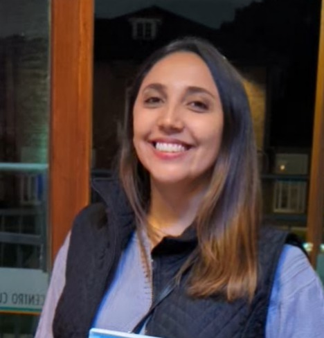

  

# Risk Analytics Professional

### Educación
Economista, Pontificia Universidad Javerianna
Magister Inteligencia Analítica de Datos, Universidad de los Andes

### Education Continua
DS4A (Data Science for All) / Colombia 3.0, Correlation One
Google Advanced Analytics Certificate

### Work Experience
- **Sr. Consultant** - TransUnion (Credit Bureau)  
- **Analytics Lead** - Epik (Fintech)  
- **Sr. Risk Professional** - Scotiabank  

### Projects

    

#### [Project: From Data to Dollars - Predicting Insurance Charges](https://www.datacamp.com/datalab/w/9b26cc20-77c8-42ad-82cc-5e529f813880/edit)

En este proyecto buscamos predecir los cargos anuales de la cobertura en salud. El problema de negocio radica en que los pacientes no suelen tener visibilidad o información completa sobre cuáles pueden ser sus costos de salud, por lo que no pueden hacer una planeación financiera adecuada para el año.  

Por otro lado, los prestadores, en algunos casos, tampoco tienen visibilidad de cuáles podrían ser los costos totales para un paciente, lo que dificulta un equilibrio personalizado entre medicina preventiva y curativa.  

Mediante análisis de regresión y probando diferentes técnicas (Regresión líneal y XGBoost Regressor), predecimos estos costos para cada paciente. Esto proporciona un estimado bastante preciso tanto para pacientes como para prestadores sobre los costos totales anuales y mensuales. El resultado se traduce en una mejor planificación financiera por parte de los pacientes y una mayor personalización en la toma de decisiones por parte de los prestadores de salud.  
 

**SQL Projects (Quick but powerful queries on Postgres)**

|  |  |
|------------------------------------|-------------------------------------|
| **[Impact Analysis of GoodThought NGO Initiatives](https://www.datacamp.com/datalab/w/cb8551ea-25bd-4088-98ac-aa1a9e15b95a/edit)** | **[Otro Proyecto](#)** |

